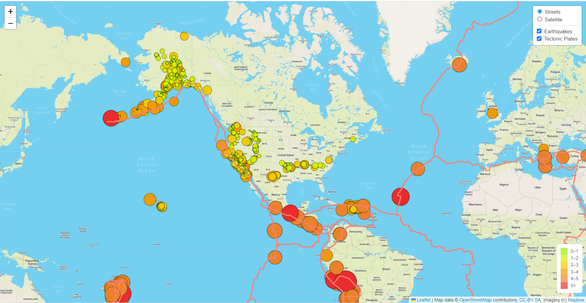
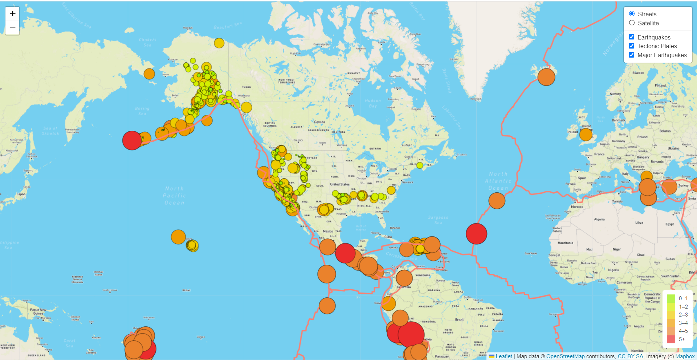
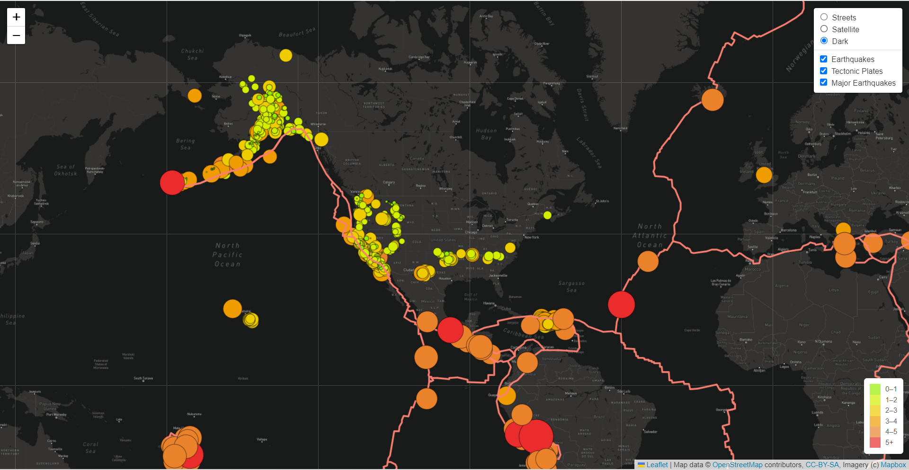

# Mapping Earthquakes:

- Deliverable 1: Add Tectonic Plate Data
- Deliverable 2: Add Major Earthquake Data
- Deliverable 3: Add an Additional Map

## Deliverable 1:
Tectonic plate data has been added to the map as a new overlay layer.

## Deliverable 2:
Major Earthquake data has been added to the map as a new overlay layer.

## Deliverable 1:
A different style map (Dark Map) has been added to the map as an additional base layer.

